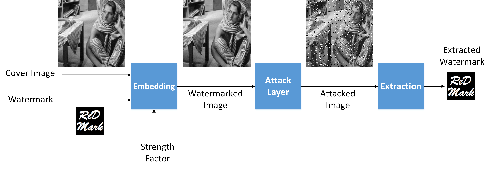
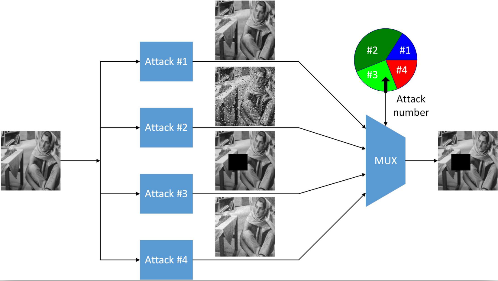
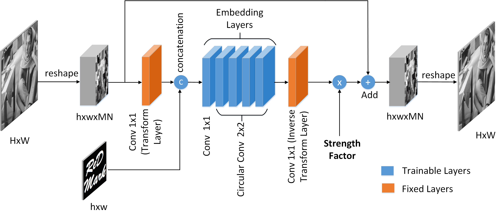

ReDMark
========

## What is ReDMark



ReDMark is a watermarking framework that uses Convolutional Neural Networks (CNNs) in watermark embedding and extraction. Both embedding and extraction networks are trained together in an end-to-end pipeline; Therefore, the trained embedding and extraction networks interact better in the real situations. 

Also, we simulate some attacks so that the networks embed the data more robustly. We implemented multiple different attacks as network layers. The most interesting attack is Jpeg attack that is written fully by network structures. Another useful attack that helped our networks to propagate the watermark data more, is grid-crop attack. The networks can be trained by multiple attacks at the same time and the results would be robust against all of them. 



## The circular convolutional layer

To share the watermark data between more image regions, we developed the novel circular convolutional layer. This layer, instead of zero-padding its input tensor, performs a circular convolution on it. 

## Notes

    1- The watermark data is fully random, i.e. is a random binary vector.
    2- In every training iteration, the random watermark and cover images are changed.
    3- Some attacks are not differentiable and cannot be implemented exactly as they are. In this cases we used their approximations. The experiments showed us that the resulting networks are robust to not only the real attack but also to a wider family of attacks.
    4- The embedding network's structure is residual. This means that the watermark data is embedded into the residual part of the pipeline and then added to the original image. This helps the transparency of the watermarked images. 



## How to use

First download pascal dataset from [here](http://host.robots.ox.ac.uk/pascal/VOC/voc2012/) and place the extracted `JPEGImages` folder in images/pascal folder. Then run the file prepare_pascal.py. 

Download the 49 test images from [here](http://decsai.ugr.es/cvg/CG/base.htm) and place them in the folder images/512x512.

To train the networks run the `Train.py` file. This file creates the network weights according to its settings. The embedding and extraction weights are saved a single .h5 file in the logs folder.

By running `Test.py`, they will be split into two separate networks. In this file, the trained networks are tested against various real attacks and their results are saved in logs/{name-of-experiment}/Analysis.
 
## Dependencies

Prior to run the codes you need the packages mentioned in the file [requirements.txt](requirements.txt). You can create a virtual environment and install the dependencies by `pip install -r requirements.txt`


## Terms of use

Please cite our paper [ReDMark: Framework for residual diffusion watermarking based on deep networks](https://www.sciencedirect.com/science/article/pii/S0957417419308759).


**BibTeX**
```
@article{Redmark,
  title={ReDMark: Framework for Residual Diffusion Watermarking based on Deep Networks},
  author={Ahmadi, Mahdi and Norouzi, Alireza and Karimi, Nader and Samavi, Shadrokh and Emami, Ali},
  journal={Expert Systems with Applications},
  pages={113157},
  year={2019},
  publisher={Elsevier}
}
```